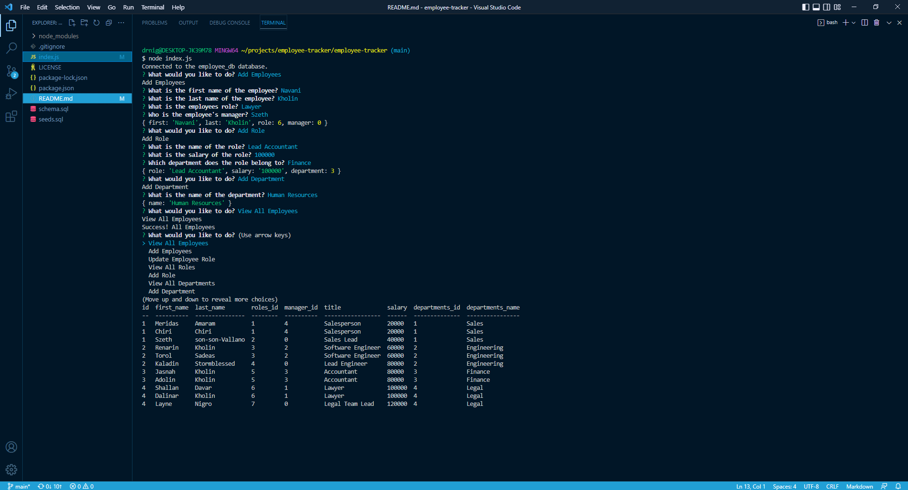

# Employee-Tracker

## Description

This application streamlines the process of creating and maintaining an employee roster. The purpose for this application is to make easily log employees along with their roles, salaries and departments in a database while also making it a simple process to update the data. I designed this application to become more familiar with mysql and improve upon my abiity to use inquirer effectively. This apllication solves an issues a business owner might have while trying to accurately track employees. I learned a lot about how to my database queries dynamic and utilizing a database using mysql.

## Usage

screenshot:

Walk through video: https://drive.google.com/file/d/1WKgsnKEVTbLaq_iahwg2CLPIlMgvMrK5/view

## License
This project is licensed under the MIT license. https://choosealicense.com/licenses/mit/

